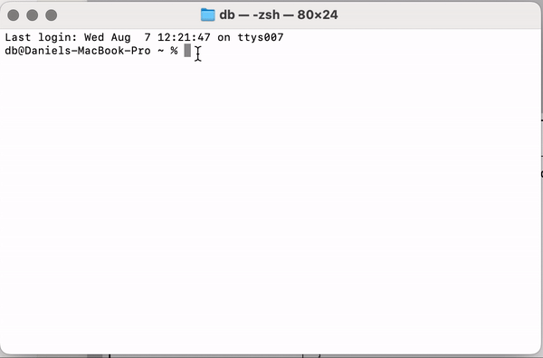
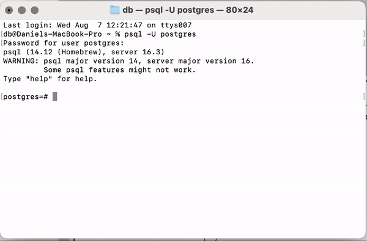
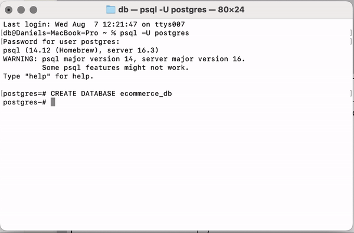
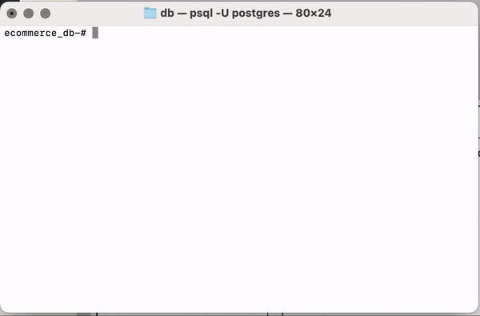
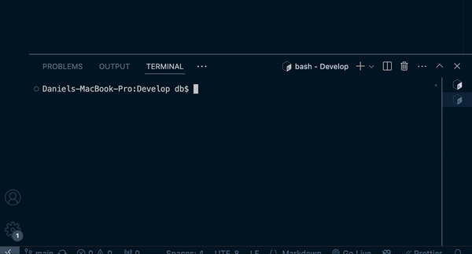
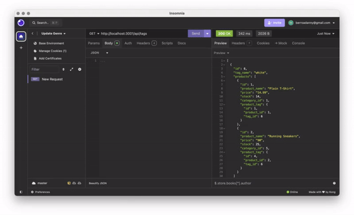
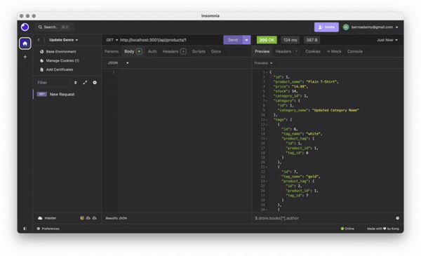
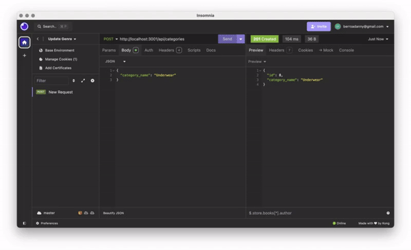

# E-commerce Back End

## Description

This project is the back end for an e-commerce site. It uses Express.js API and configures it to use Sequelize to interact with a PostgreSQL database. This application provides a robust set of API endpoints for managing categories, products, and tags in an e-commerce platform.

## Table of Contents

- [Installation](#installation)
- [Usage](#usage)
- [API Routes](#api-routes)
- [Database Models](#database-models)
- [Associations](#associations)
- [Contributing](#contributing)
- [Questions](#questions)

## Installation

1. Clone the repository to your local machine.
2. Navigate to the project directory.
3. Run `npm install` to install the necessary dependencies.
4. Create a `.env` file in the root directory with the following content:

   ```bash
   DB_NAME='ecommerce_db'
   DB_USER='postgres'
   DB_PASSWORD='your_postgres_password'
   ```

5. Create the database using PostgreSQL shell:

   ```bash
   psql -U your_username
   CREATE DATABASE ecommerce_db;
   \q
   ```

6. Run the schema file:

   ```bash
   psql -U your_username -d ecommerce_db -f Develop/db/schema.sql
   ```

7. Seed the database:

   ```bash
   npm run seed
   ```

## Usage

1. Start the server:

   ```bash
   npm start
   ```

2. Use an API client like Insomnia Core to test the API routes.

## Demonstrations

### Connecting Postgres

This video animation demonstrates connecting postgress.


### Create New Database

This video animation demonstrates connecting the new database.


### Connect New Database

This video animation demonstrates connecting the new database.


### Run The Schema

This video animation demonstrates running the schema.


### Run The Seeds

This video animation demonstrates running the seeds in the command line.


### Start The Server

This video animation demonstrates starting the server.


### All Routes

This animation demonstrates all the available API routes in action.


### Single Categories

This animation illustrates retrieving and manipulating single category data.


### Delete Categories

This animation shows the process of deleting a category and handling associated products.


## API Routes

- Categories
  - GET all categories: `/api/categories`
  - GET a single category: `/api/categories/:id`
  - POST a new category: `/api/categories`
  - PUT update a category: `/api/categories/:id`
  - DELETE a category: `/api/categories/:id`

- Products
  - GET all products: `/api/products`
  - GET a single product: `/api/products/:id`
  - POST a new product: `/api/products`
  - PUT update a product: `/api/products/:id`
  - DELETE a product: `/api/products/:id`

- Tags
  - GET all tags: `/api/tags`
  - GET a single tag: `/api/tags/:id`
  - POST a new tag: `/api/tags`
  - PUT update a tag: `/api/tags/:id`
  - DELETE a tag: `/api/tags/:id`

## Database Models

- Category
  - id (Integer, Primary Key)
  - category_name (String)

- Product
  - id (Integer, Primary Key)
  - product_name (String)
  - price (Decimal)
  - stock (Integer)
  - category_id (Integer, Foreign Key)

- Tag
  - id (Integer, Primary Key)
  - tag_name (String)

- ProductTag
  - id (Integer, Primary Key)
  - product_id (Integer, Foreign Key)
  - tag_id (Integer, Foreign Key)

## Associations

- Product belongs to Category
- Category has many Product models
- Product belongs to many Tag models (through ProductTag)
- Tag belongs to many Product models (through ProductTag)

## Contributing

Contributions to improve the project are welcome. Please fork the repository and create a pull request with your changes.

## Questions

If you have any questions about the project, please open an issue or contact me directly at [berroadanny@gmail.com](mailto:berroadanny@gmail.com).

You can find more of my work at [Daniel369](https://github.com/Daniel369)
